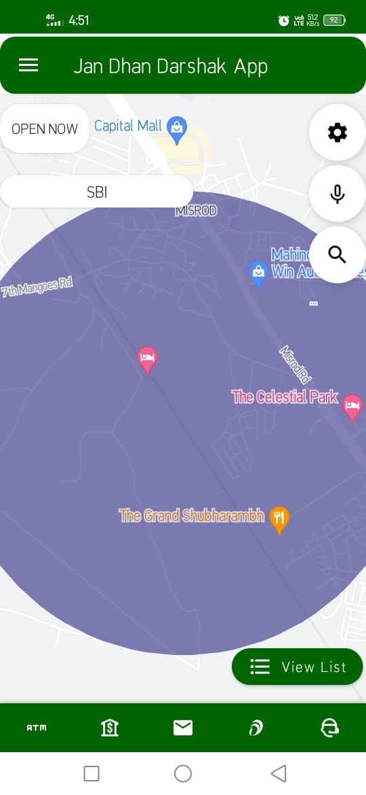
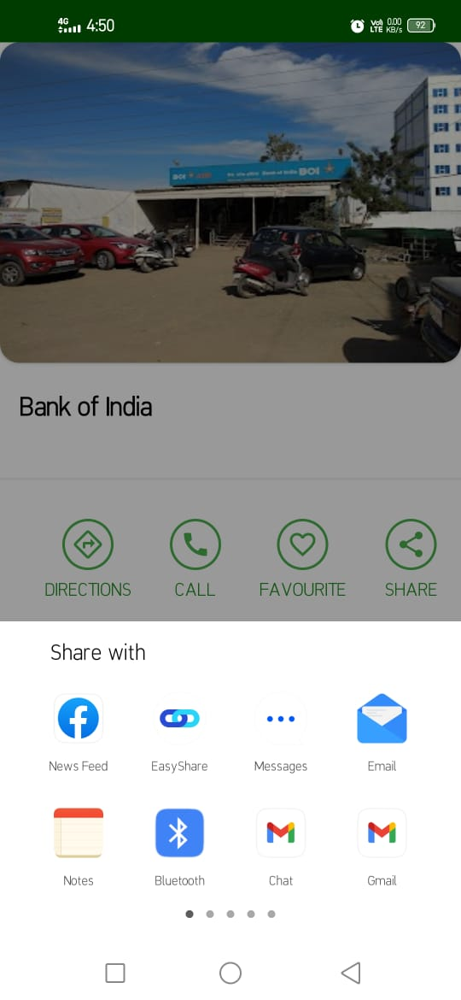

# Upgradation of Jan Dhan Darshak App

## Future that we seek

**Personalization**  
Our app works on both, the google dataset using API keys and custom dataset using some algorithms, thus making it flexible for any needs.

Presently it's just for Ministry of Finance and DFS, but with our custom dataset implementation, any organization can extend our app for their own map services.
One can access, display and perform operations on entries from their custom dataset or from DBs that can only be queried using API keys(Google Maps in our case).

- You can also lookup for entries from sample dataset using voice and text search.
- Admin has been given the privilege to modify dataset which is directly reflected on map.

    &emsp;
  &emsp;

 

## Salient features and use cases

    &emsp;
    &emsp;
  &emsp;

 

**1) Know all about your nearby financial touch points**
App is mainly focused on displaying info of your nearby financial touch points like ATMs, Banks, Post Offices, CSC and Bank Mitra.
- Complete details: Address, Opening/Closing hours, images
- Navigate to selected location
- Share location to anyone  

    &emsp;
  &emsp;
  &emsp;

 

**2) Contribute**  
Wish to help improve the map? Use our missing location suggestions feature. Simply tap at that area on the map and fill out the form for developers to get precise details.

**3) User Authentication & Personalization**  
Any registered user can simply login using mobile number and a 6-digit numeric OTP(auto-detected). Creating an account helps user to:
- Send missing location suggestions
- Save favourite locations
- Write feedback  

    &emsp;
    <b>Generated OTP message</b>
    &emsp;

 

**4) Set custom buffer distance**  
Displays the locations in circle of selected radius.
Since Google places API doesn't give you the freedom to select custom radius, we created a basic model for getting specified results from given dataset.
Find our implementation in the distance_filter.inpynb file added. One can create any model and use it for better results.   

    &emsp;
    &emsp;

 

**5) Various Map themes and help feature**  
Aubergine, Dark, Standard, Retro , Silver, we have it all. Select and use app in map theme.  

    &emsp;
    &emsp;

 

**6)Multilingual feature**  
Use app in your local language. Our app supports Hindi, English, Telugu, Tamil, Marathi, Kannada, Bengali, Punjabi and Gujarati (Some minor bug fixes required).

**7) Filter banks by name**  
Select bank of your choice and our app will display those only.(Some minor bugs fixes required).

**8) Voice and Text search**

## Ideas that can be implemented

- Scheduling the date/time of visit to specified location.
- Adding online services provided by banks.

